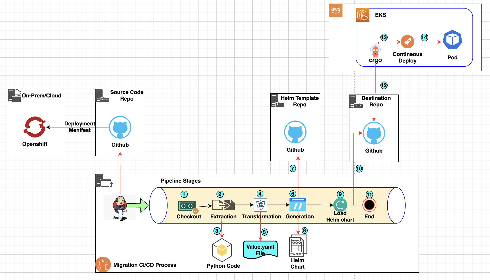

# RedHat Openshift to AWS EKS migration: Automation Strategies for Smooth Transition

## Business Problem Statement.
Many organizations currently run their critical business applications on RedHat OpenShift. However, due to challenges like vendor lock-in, high operational costs, and complexity, they are increasingly migrating to cloud-native platforms such as AWS EKS as part of their cloud adoption and modernization journey.
During the cloud adoption and modernization process, numerous customers are transitioning their on-premises containerized applications from OpenShift to AWS Elastic Kubernetes Service (EKS). This migration frequently necessitates the manual conversion of OpenShift deployment files into Helm charts compatible with EKS, a process that can be time-consuming and susceptible to errors. Ensuring a seamless transition without modifying the applications demands significant manual effort, often involving meticulous attention to detail to guarantee that applications are onboarded correctly without any unintended alterations.
By leveraging automation strategies, businesses can ensure a seamless transition, maintaining application integrity, reducing errors, and accelerating cloud adoption while achieving improved scalability and operational efficiency

## Discovery Phase.
   - During the discovery phase, we have identified that more than ~500 applications need to be migrated to EKS-compatible Helm Charts while preserving the original behavior of the applications.
   - An enterprise-grade EKS cluster has been provisioned.
   - A CI/CD server has been provisioned.

## Business Requirement.
   - Streamline Development Timelines and Optimize Costs through Efficient Processes
   - Ensure Accurate and Seamless Migration from OpenShift to EKS
   - Accelerate Time-to-Market with Agile Methodologies
   - Implement Robust CI/CD Pipeline Configuration for Seamless, Zero-Touch Migration.
   
## Service/Tools Used In Solution.
   - Python 3.12+
   - Jenkins(CI/CD)
   - Kubectl 1.30+ (recomonded simillar version of your cluster)
   - AWS CLI(2+)
   - GIT(2.40+)

## Solution Architecture .
The following solution architecture diagram illustrates a proposed approach to address the given problem statement.

## Solution WorkFlow
The solution configured in the Jenkins CI/CD pipeline consists of multiple stages for transformation. The following are the details of each stages:

   1. **CheckOut**       : Retrieve the source code, templates, and destination configurations from the respective repositories into the Jenkins workspace for further processing.
   2. **Extraction**     : Execute Python scripts on the source code files (OpenShift) to extract the required data compatible with the Elastic Kubernetes Service (EKS) and store it locally.
   3. **Transformation** : Generate a Helm Chart-compatible values.yaml file in the Jenkins workspace, containing the extracted data and necessary configurations.
   4. **Generation**     : Copy the template files from the Jenkins workspace and generate a new Helm Chart with the updated values.yaml file.
   5. **Load**           : Push the generated Helm Chart to the destination Git repository.
   6. **Deployment**     : Deploy the Helm Chart to the EKS cluster using ArgoCD or Kubectl for automated deployment and management.

## Deployment Steps
   ### Prerequisites
   1. An active Amazon Elastic Kubernetes Service (EKS) cluster
   2. The following tools and utilities are installed and configured on the Jenkins server:
      - Git for version control
      - Kubernetes CLI (kubectl) for managing the EKS cluster
      - AWS Command Line Interface (AWS CLI) for interacting with AWS services
      - Python 3 for executing Python scripts
   3. Credential files (e.g., AWS access keys, Git credentials) are securely configured in the Jenkins Global Configuration for authentication and authorization purposes.
      - **GIT_CREDENTIAL** : create a credential file for Git connectivity with name as "GIT_CREDENTIAL" used for git clone
      - **AWS_CREDENTIAL** : create a credential file for AWS connectivity with name as "AWS_CREDENTIAL" used for deploy into cluster.

   ### Deployment Configuration
   1. Clone the Repository:
      - Open your terminal or command prompt.
      - Navigate to the directory where you want to clone the repository.
      - Run the command: git clone <repository_url> (replace <repository_url> with the actual URL of the repository you want to clone).
   2. Create a new GitHub repository:
      - Go to your GitHub account and create a new repository.
      - Follow the instructions provided by GitHub to initialize the new repository.
   3. Push the cloned code to your new GitHub repository:
      - In the terminal, navigate to the cloned repository directory.
      - Run the command: git remote set-url origin <your_new_repo_url> (replace <your_new_repo_url> with the URL of your new GitHub repository).
      - Run the command: git push -u origin master (or git push -u origin main if your default branch is named "main").
   4. Create a new Jenkins Pipeline Job:
      - Log in to your Jenkins instance.
      - Navigate to the "New Item" section.
      - Enter a name for your new job and select the "Pipeline" option.
      - Click "OK" to proceed.
   5. Configure the Jenkins Pipeline Job:
      - In the job configuration, scroll down to the "Pipeline" section.
      - Select the "Pipeline script from SCM" option.
      - Choose the appropriate SCM (Source Control Management) option, such as Git.
      - Enter the URL of your new GitHub repository.
      - If required, provide any additional credentials or configurations.
      - Save the job configuration.
   6. Build the Jenkins Pipeline Job:
      - In the Jenkins dashboard, locate your newly created job.
      - Click the "Build Now" option to trigger the first build.
      - Monitor the build console output for any errors or issues.
   
   ### Required Parameter In Jenkin Jobs
   
   - **SRC_GIT_REPO**:  'Source Openshift Git Repository' 
   - **SRC_GIT_BRANCH**: 'Source Openshift Git Branch'
   - **DEST_GIT_REPO**:  'Destination  Git Repository used to store converted files'
   - **DEST_GIT_BRANCH**: 'Destination  Git Branch used to store converted files'
   - **HELM_TEMPLATE_REPO**:  'Helm Template Repository consists of helm templates for deployment,service,etc'
   - **HELM_TEMPLATE_BRANCH**: 'Helm Template Repository Branch consists of helm templates for deployment,service,etc'  
   - **DEPLOY_MODE**: choices: ['Install', 'Destroy', 'View'] : 'Select Deployment action you need to perform in Cluster'
   - **CLUSTER_NAME**: 'Provide EKS CLuster Name where to deploy converted files'
   - **REGION**:  'AWS EKS cluster region Where to Deploy where to deploy converted files'
   - **NAMESPACE**: 'Deployment Namespace where to deploy converted files'
   
   **Parameter Example**

    required parameters {
        'SRC_GIT_REPO'  = 'https://SRC_GIT-url.com'
        'SRC_GIT_BRANCH' = 'main'
        'DEST_GIT_REPO' = 'https://DEST_GIT-url.com'
        'DEST_GIT_BRANCH = 'main'
        'HELM_TEMPLATE_REPO = 'https://TEMPLATE_GIT-url.com'
        'HELM_TEMPLATE_BRANCH' = 'main' 
        'DEPLOY_MODE' = 'install'
        'CLUSTER_NAME' = 'eks-cluster-test'
        'REGION' = 'us-east-1'
        'NAMESPACE' = 'dev'      
    }
## Testing
   - Wait till jenkin pipeline jobs to suceeed
   - Check destination Repo , Converted files are pushed
   - In cas of any issue , check jenkin logs for debug

## Solution Outcome
   
   - **Efficiency**:  Implemented a highly efficient, automated Zero-Touch Migration Strategy with seamless CI/CD integration, ensuring a streamlined and optimized migration process.
   - **Business Value**: Successfully migrated over ~500 mission-critical OS namespaces to Amazon Elastic Kubernetes Service (EKS) within an impressive one-week timeframe, demonstrating exceptional agility and responsiveness.
   - **Process Optimization**: Adopted a meticulously streamlined process that minimized manual effort, mitigated potential errors, and fostered a high degree of operational efficiency.
   - **Improve Reliability and Performance**: Leveraged Automated Root Cause Analysis (ARCA) to swiftly identify and resolve issues, enhancing system reliability and ensuring optimal performance.
   - **Accelerated Time-to-Market**: Automation significantly reduced the time required for migration, minimizing manual intervention and enabling rapid deployment of applications and services.
   - **Consistency**: Ensured uniform configuration and deployment across all applications, promoting standardization and facilitating easier maintenance and scalability.
   - **Scalability**: Implemented an automated process that can be seamlessly scaled to accommodate future migrations, providing flexibility and future-proofing the organization's infrastructure.
   - **Cost Efficiency**: The automated migration strategy significantly reduced development costs, optimizing resource utilization and delivering substantial cost savings.
   - **Enhanced Integration and Security**: Leveraged native integration with AWS services, improving overall system performance, enhancing security posture, and fostering operational efficiency.
   - **Continuous Deployment Enablement**: Facilitated automated and continuous deployment using cutting-edge tools like ArgoCD, enabling rapid iteration, faster time-to-market, and increased agility.

## Security

   See [CONTRIBUTING](CONTRIBUTING.md#security-issue-notifications) for more information.

## License

   This library is licensed under the MIT-0 License. See the LICENSE file.

