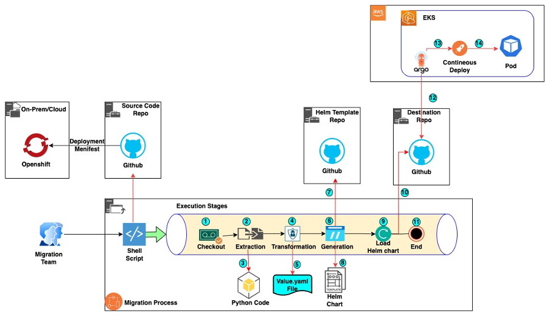

# RedHat Openshift to AWS EKS migration: Automation Strategies for Smooth Transition

## Business Problem Statement.
During the cloud adoption and modernization process, numerous customers are transitioning their on-premises containerized applications from OpenShift to AWS Elastic Kubernetes Service (EKS). This migration frequently necessitates the manual conversion of OpenShift deployment files into Helm charts compatible with EKS, a process that can be time-consuming and susceptible to errors. Ensuring a seamless transition without modifying the applications demands significant manual effort, often involving meticulous attention to detail to guarantee that applications are onboarded correctly without any unintended alterations.

## Business Requirement.
   - Streamline Development Timelines and Optimize Costs through Efficient Processes
   - Ensure Accurate and Seamless Migration from OpenShift to EKS
   - Accelerate Time-to-Market with Agile Methodologies
   - Implement Robust CI/CD Pipeline Configuration for Seamless, Zero-Touch Migration.
   
## Service/Tools Used In Solution.
   - Python 3.12+
   - GIT(2.40+)
   - Jenkins(CI/CD)(Optional)

## Solution WorkFlow
As migration processes increase in accuracy, complexity, and effort, it becomes essential to implement an automated system that can handle all manual migration tasks with 100% accuracy. This automated process enables development and migration teams to efficiently address all migration concerns while ensuring the utmost accuracy in validation. Within minutes, thousands of applications can be seamlessly migrated from OpenShift to EKS.

The diagram below depicts the architectural framework designed to expedite the application migration process from OpenShift to Amazon EKS through automation.

This automated system seamlessly integrates with various CI tools or can be executed manually via shell script. The workflow begins when an end-user triggers a job in a CI tool (such as Jenkins), a continuous integration and delivery service that orchestrates the migration process. Upon initiation, the CI tool executes the following stages of the migration process.

1. Check out the OpenShift deployment manifest from the source code repository using authenticated HTTPS/SSH connections. Verify repository signatures and manifest integrity through checksums.
2. Initiate the extraction process in an isolated environment with proper access controls.
3. Execute the Python script with input validation to extract information from the OpenShift manifest file. The script runs with least-privilege permissions and validates data integrity.
4. Transform OpenShift values to EKS-compatible values while maintaining security contexts, RBAC permissions, and network policies. Validate all security-related configurations during transformation.
5. Generate an encrypted "values.yaml" file for the Helm chart, implementing secure secret management.
6. Create a Helm chart following security best practices, including secure defaults, network policies, and proper security contexts.
7. Copy template files from the verified and authenticated template repository through secure channels. Validate template integrity using checksums.
8. Generate the final Helm chart with all security configurations intact. Implement security validation checks before finalisation.
9. Load the updated Helm chart into the destination repository using signed commits and authenticated connections.
10. Configure ArgoCD with security best practices (RBAC, TLS, authentication) to automatically detect and deploy the updated Helm chart to the security-compliant AWS EKS platform.
11. Optionally , you can easily integrate with Jenkin/CI system to execute the migration.sh file from CI system.

Optionally, organizations can create their own Continuous Deployment (CD) platform to deploy updated Helm charts from a destination repository into Amazon Web Services Elastic Kubernetes Service (AWS EKS).

## Deployment Steps
   ### Prerequisites
   To follow along with this post, ensure you have the following:
   1.	Python 3 or later installed in your CI system
   2.	Required Python Packages (pyyaml)
   3.	Git 2 or later installed in your CI system
   4.	A template repository and a destination source code repository should be created before running migration script
   5.	All Helm chart template files copied into the template repository
   6.	Your EKS cluster configured with Argo CD for continuous deployment.(Optional)
   7.	Configured Git credentials for manual execution of migration process
   8.	Configured CI/CD tools (Optional)
   

   ### Deployment Configuration
   
   #### Manual Migration process
   1. Clone the Repository:
      - Open your terminal or command prompt.
      - Navigate to the directory where you want to clone the repository.
      - Run the below command to clone the repository into local system: 

      `git clone https://github.com/aws-samples/RedHat-Openshift-to-AWS-EKS-migration.git

   2. Run migration script
      - Open your terminal or command prompt.
 
            - cd openshift-migration

            - chmod +x migration.sh

            - ./migration.sh
            
      - below parameters required during execution of script
         - Select single/mupltiple Repo(S/M) : Indicates scource code present in One repo or multiple repo.
         - Incase single repo selected (S), below parameters required
            - **Enter Source Repository URL**: https://github.com/sourcecode.git
            - **Enter Source Repository Branch**: main
            - **Enter Template Repository URL**: https://github.com/template.git            
            - **Enter Template Repository Branch**: main
            - **Enter Destination Repository URL**: https://github.com/output.git        
            - **Enter Destination Repository Branch**: main
         - Incase Multiple repo selected (M), below parameters required
            - create a configuration files in the same folder , refer example format "env.cfg"
            - **Provide configuration FileName, Default file (env.cfg)**: env.cfg
         - **Confirm Migration Start (yes/no)**: yes
         - Script will automatically checkout Openshift sourcecode repo and helm templete files , convert source code into helm chart 
         - Once convert completed ,stored all converted files into the destination repo. 
         - Once all files stored in the destination repository , you can create Application in argoCD to deploy into EKS cluster or else configured CD process to deploy into the EKS cluster.

   #### Using Jenkin:
   The diagram below explain the migration process using Jenkin
   
   
   ### Required Parameter In Jenkin Jobs
   Refer the file "Jenkinsfile" in same directory .create a Jenkin pipeline and below string parameters
      - **SRC_GIT_REPO**:  'Source Openshift Git Repository' 
      - **SRC_GIT_BRANCH**: 'Source Openshift Git Branch'
      - **DEST_GIT_REPO**:  'Destination  Git Repository used to store converted files'
      - **DEST_GIT_BRANCH**: 'Destination  Git Branch used to store converted files'
      - **HELM_TEMPLATE_REPO**:  'Helm Template Repository consists of helm templates for deployment,service,etc'
      - **HELM_TEMPLATE_BRANCH**: 'Helm Template Repository Branch consists of helm templates for deployment,service,etc'  
   
   **Parameter Example**

    required parameters {
        'SRC_GIT_REPO'  = 'https://SRC_GIT-url.com'
        'SRC_GIT_BRANCH' = 'main'
        'DEST_GIT_REPO' = 'https://DEST_GIT-url.com'
        'DEST_GIT_BRANCH = 'main'
        'HELM_TEMPLATE_REPO = 'https://TEMPLATE_GIT-url.com'
        'HELM_TEMPLATE_BRANCH' = 'main'     
    }
## Testing
   - Wait till jenkin pipeline jobs to suceeed
   - Check destination Repo , Converted files are pushed
   - In cas of any issue , check jenkin logs for debug

## Solution Outcome
   
   - **Efficiency**:  Implemented a highly efficient, automated Zero-Touch Migration Strategy with seamless CI/CD integration, ensuring a streamlined and optimized migration process.
   - **Business Value**: Successfully migrated over ~500 mission-critical OS namespaces to Amazon Elastic Kubernetes Service (EKS) within an impressive one-week timeframe, demonstrating exceptional agility and responsiveness.
   - **Process Optimization**: Adopted a meticulously streamlined process that minimized manual effort, mitigated potential errors, and fostered a high degree of operational efficiency.
   - **Improve Reliability and Performance**: Leveraged Automated Root Cause Analysis (ARCA) to swiftly identify and resolve issues, enhancing system reliability and ensuring optimal performance.
   - **Accelerated Time-to-Market**: Automation significantly reduced the time required for migration, minimizing manual intervention and enabling rapid deployment of applications and services.
   - **Consistency**: Ensured uniform configuration and deployment across all applications, promoting standardization and facilitating easier maintenance and scalability.
   - **Scalability**: Implemented an automated process that can be seamlessly scaled to accommodate future migrations, providing flexibility and future-proofing the organization's infrastructure.
   - **Cost Efficiency**: The automated migration strategy significantly reduced development costs, optimizing resource utilization and delivering substantial cost savings.
   - **Enhanced Integration and Security**: Leveraged native integration with AWS services, improving overall system performance, enhancing security posture, and fostering operational efficiency.
   - **Continuous Deployment Enablement**: Facilitated automated and continuous deployment using cutting-edge tools like ArgoCD, enabling rapid iteration, faster time-to-market, and increased agility.
